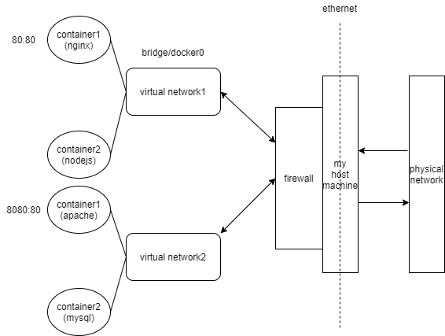

# Creating and Using Containers Like a Boss

설치는 생략

- docker 공식 사이트에 잘 나와있다
- 나는 docker toolbox를 사용해서 진행한다

docker 버전 체크하기

```terminal
$ docker version
```

- 현재 설치되어 있는 도커의 버전을 알려준다

docker 정보 체크하기

```terminal
$ docker info
```

- 컨테이너가 몇 개이고 실행중인 것, 잠시 멈춰있는 것, 중지된 것이 몇개인지 등 정보를 알려준다
- 이 외에도 이미지, 버전, 드라이버 등 훨씬 많은 정보를 확인할 수 있다

docker commands

- 오래된 방식

```terminal
$ docker <command>
```

- 새로운 방식

```terminal
$ docker <command> <sub-command>
```

- 예를 들어, docker를 터미널에 입력해보면 Management Commands와 Commands의 목록이 나오는데 docker container run 처럼 커맨드 여러개를 목적에 따라 조합해서 사용할 수 있다

---

이미지와 컨테이너

- 이미지란 바이너리, 라이브러리, 소스 코드 등 애플리케이션을 구성하고 있는 것이다
- 컨테이너란 이미지가 실행되고 있는 인스턴스다
- 같은 이미지를 실행하는 여러 컨테이너를 가질 수 있다

nginx 이미지를 이용해서 컨테이너를 실행해보기

- nginx 이미지 다운받기

```terminal
$ docker container run --publish 80:80 nginx
```

- nginx이미지를 Docker Hub에서 받아온다
- 받아온 이미지를 이용해 새 컨테이너를 시작한다
- 호스트IP의 80포트를 연다
- 컨테이너 IP로 80을 라우팅한다
- localhost:80으로 접속해보면 아마 nginx서버가 뜰 것이다
- 윈도우에서 docker toolbox를 사용하는 환경이라면 http://192.168.99.100/로 접속해야한다

백그라운드에서 nginx 실행하기

```terminal
$ docker container run --publish 80:80 --detach nginx
```

- --detach 옵션이 추가됐다. 이 옵션을 추가하면 이미지를 백그라운드에서 실행한다

실행되고 있는 컨테이너 목록 확인하기

```terminal
$ docker container ls
```

실행중인 컨테이너 정지하기

```terminal
$ docker container stop <unique-container-id>
```

- 유니크 컨테이너 아이디는 위의 docker container ls를 보고 확인한다

기본으로 실행되는 컨테이너 확인하기

```terminal
$ docker container ls -a
```

- 아마 도커를 여러번 사용했다면 많은 컨테이너가 있을 수도 있다
- 이는 docker의 run과 start의 차이 때문에 일어나는 일이다
- docker container run은 언제나 새로운 컨테이너를 만들어 실행한다
- docker container start는 이미 실행중인 컨테이너를 정지시키고 나서 실행한다

실행중인 컨테이너의 이름 지정하기

```terminal
$ docker container run --publish 80:80 --detach --name webhost nginx
```

- 컨테이너의 이름을 지정하지 않으면 도커가 임의로 과학자의 이름을 집어넣어준다
- 컨테이너 이름을 직접 입력하려면 위와 같이 --name 뒤에 컨테이너 이름을 입력하면 된다

컨테이너 이름 활용하기

- 먼저 브라우저로 localhost에 몇번 접속한 뒤에 아래의 커맨드를 입력해보자

```terminal
$ docker container logs webhost
```

- 접속한만큼 로그가 찍혀있을 것이다
- 낡은 방법이지만 docker logs로도 확인할 수 있다

  - docker logs webhost와 같이 입력하면 된다

- 실행중인 컨테이너 상태를 확인하기

```terminal
$ docker container top webhost
```

- UID, PID 등의 정보를 확인할 수 있다

생성된 컨테이너 삭제하기

```terminal
$ docker container rm c_id1 c_id2, ...
```

- 삭제할 컨테이너의 아이디 목록을 스페이스를 추가해가며 입력하면 된다
- 만약 실행중인 컨테이너라면 에러가 발생하면서 삭제되지 않을 것이다

실행중인 컨테이너까지 강제로 삭제하기

```terminal
$ docker container rm -f c_id ...
```

- -f 옵션(force)을 추가하면 강제로 실행중인 컨테이너까지 삭제해준다

docker container run을 실행했을 때 일어나는 일 정리해보기

1. 이미지 캐시가 로컬환경에 있는지 체크한다. 있으면 캐싱되어 있는 이미지를 사용한다
2. 없다면 원격 저장소(Docker hub)에서 찾는다
3. 최신 버전을 다운로드한다(:버전명을 지정해 특정 버전을 받을 수도 있다)
4. 이미지에 기초해 새로운 컨테이너를 생성하고 시작할 준비를 한다
5. 도커 엔진 안에 있는 프라이빗 네트워크에 버츄얼 ip를 부여한다
6. 호스트의 특정 포트(ex. 80)을 열고 컨테이너의 포트(ex. 80)를 향하게 한다(ex. 80:80)
7. image Dockerfile에 있는 CMD를 사용해 컨테이너를 실행한다

run 커맨드에서 바꿀 수 있는 부분들

```terminal
$ docker container run --publish 8080:80 --name webhost -d nginx:1.11 nginx -T
```

- 우선 8080처럼 호스트 포트를 변경할 수 있다
- name도 이미지에 따라 알맞게 변경할 수 있다
- nginx:버전명처럼 특정 버전을 사용할 수 있다
- nginx -T처럼 CMD를 변경할 수도 있다

---

컨테이너와 VM의 차이점

- 컨테이너는 단순히 하나의 프로세스일 뿐이다
- 컨테이너는 컨테이너가 접근할 수 있는 자원에 한정된다

간단한 예제로 차이를 확인해보기

- 우선 mongodb 이미지로 컨테이너를 실행해보자

```terminal
$ docker container run --name mongo -d mongo
```

- top 커맨드로 특정 컨테이너에서 실행중인 프로세스 목록을 확인할 수 있다

```terminal
$ docker container top mongo
```

- 호스트에서 실행중인 프로세스 목록 확인하기

```terminal
$ ps aux
```

- root와 다른 프로세스 ID를 가진 mongo프로세스를 확인할 수 있을 것이다
- 이처럼 VM과 달리 컨테이너는 호스트 컴퓨터에서 직접 접근할 수 있는 프로세스다

---

복수의 컨테이너 관리 예제

1. docs.docker.com이나 docker terminal의 --help를 항상 참조하면서 진행해보자
2. 이 예제에서는 nginx, mysql, httpd(apache) 서버를 실행할 것이다
3. --detach(or -d)옵션으로 모두 백그라운드에서 실행한다. --name으로 이름도 각각 지정한다
4. 각각의 포트 지정하기 : nginx는 80:80, httpd는 8080:80, mysql은 3306:3306으로 지정한다
5. mysql을 실행할 때는 --env(or -e)옵션에 MYSQL_RANDOM_ROOT_PASSWORD=yes 옵션을 지정한다
6. docker container logs를 mysql 컨테이너에 사용해 랜덤패스워드를 찾는다
7. docker container stop과 docker container rm으로 모든 컨테이너를 종료시킨다
8. docker container ls로 틈틈이 실행한 커맨드가 잘 적용됐는지, 마지막에는 모두 종료되었는지를 확인해준다

예제 정답

- mysql 컨테이너 실행하기

```terminal
$ docker container run -p 3306:3306 -d --name mysql -e MYSQL_RANDOM_ROOT_PASSWORD=yes mysql
```

- 랜덤패스워드를 찾기

```terminal
$ docker container logs mysql
```

- GENERATED PASSWORD가 로그안에 있을 것이다

  - 2020-02-02 03:51:43+00:00 [Note][entrypoint]: GENERATED ROOT PASSWORD: Feey8jieth2vu5pai3giephooh7ixuaP
  - 위와 같은 로그가 있어야 한다

- 아파치 컨테이너 실행하기

```terminal
$ docker container run -d -p 8080:80 --name apache httpd
```

- 틈틈이 docker container ps나 ls로 잘 실행되어 있는지 확인해주자

* nginx 컨테이너 실행하기

```terminal
$ docker container run -d -p 80:80 --name nginx nginx
```

- curl로 아파치와 엔진엑스가 잘 실행되어 있는지 실제로 확인해보기

```terminal
$ curl localhost:80
$ curl localhost:8080
```

- 도커 툴박스를 사용하는 경우 localhost대신 192.168.99.100을 사용해야 한다

- 컨테이너 중지시키기

```terminal
$ docker container stop mysql nginx apache
```

- 컨테이너 삭제하기

```terminal
$ docker container rm cid1 cid2 cid3
```

---

CLI를 통해 컨테이너를 모니터링하기

- docker container top
  - 하나의 컨테이너의 프로세스 목록을 체크
- docker container inspect
  - 하나의 컨테이너의 상세 설정을 체크
- docker container stats
  - 모든 컨테이너의 퍼포먼스와 관련된 통계수치를 체크

각 커맨드를 사용해보기 위해 컨테이너를 실행하기

```terminal
$ docker container run -d --name nginx nginx
$ docker container run -d --name mysql -e MYSQL_RANDOM_ROOT_PASSWORD=true mysql
```

mysql 프로세스 목록 체크

```terminal
$ docker container top mysql
```

mysql 컨테이너의 상세 설정 체크

```terminal
$ docker container inspect mysql
```

실시간으로 모든 컨테이너의 퍼포먼스 수치 체크

```terminal
$ docker container stats
```

---

컨테이너를 커맨드로 조작하기(실행, 커맨드 추가)

- docker container run -it
  - 새로운 컨테이너를 시작하고 터미널 조작하기
- docker container exec -it
  - 기존 컨테이너의 터미널 조작하기
- -it의 의미
  - -i와 -t가 합쳐진 옵션을 추가한 것이다
  - -i
    - interactive 옵션 : terminal의 인풋을 받아들일 수 있도록 세션 오픈을 유지하는 옵션
  - -t
    - pseudo-tty 옵션 : 실제 터미널을 시뮬레이션하기(SSH가 하는 것처럼)

새로운 컨테이너 실행하기

```terminal
$ docker container run -it --name proxy nginx bash
```

- bash 옵션을 -it와 함께 사용하면, 실행중인 컨테이너에 bash shell을 할당한다

아마 아래와 같은 화면이 뜰 것이다

```terminal
$ docker container run -it --name proxy nginx bash
root@b0bff28ac6b3:/#
```

- exit을 입력하면 터미널을 종료할 수 있다

exit로 터미널을 종료한 뒤 docker container ls로 확인해보기

```terminal
root@b0bff28ac6b3:/# exit
$ docker container ls
```

- 아마 위에서 실행했던 proxy 컨테이너 목록은 나오지 않을 것이다
- docker container ls -a를 입력해보면 proxy 컨테이너가 생성은 되어 있다
- 생성은 제대로 되었으나 종료되어 있는 것은 위에서 입력했던 bash 커맨드 때문이다
- bash 커맨드를 입력하면 bash 터미널을 켜져 있을 때만 컨테이너가 실행된다

만약 실행하는 컨테이너가 우분투라면 우분투의 기본 터미널이 bash이므로 추가하지 않아도 된다

```terminal
$ docker container run -it --name ubuntu ubuntu
```

- 컨테이너 실행이 완료되면 bash 커맨드를 주지 않았는데도 자동으로 아래와 같은 화면이 뜰 것이다

```terminal
root@d9c2c9a036ef:/#
```

exit로 우분투 컨테이너를 종료한 다음 우분투 컨테이너를 다시 실행하기

```terminal
root@d9c2c9a036ef:/# exit
$ docker container start -ai ubuntu
```

exec커맨드로 mysql이나 nginx 등의 실행중인 컨테이너를 bash로 조작하기

```terminal
$ docker container exec -it mysql bash
```

Alpine리눅스처럼 bash를 포함하고 있지 않은 이미지의 경우

- docker container run -it alpine bash를 입력해도 제대로 실행되지 않는다
- Alpine리눅스는 4mb도 되지 않는 매우 작은 이미지로 bash shell을 포함하고 있지 않기 때문이다
- bash 대신 sh를 입력하면 부족한 기능이 있긴 하지만 실행시킬 수 있다

도커 네트워크

- 기본 개념들
  - 각각의 컨테이너는 특정한 도커 네트워크로 연결되어 있다
  - 컨테이너를 연결시켜주는 이 프라이빗 버츄얼 네트워크인 '브릿지'네트워크를 뒤에서 알아볼 것이다
  - 각각의 프라이빗 버츄얼 네트워크는 NAT 방화벽을 통해 라우팅된다
    - Docker daemon이 host ip를 설정해 인터넷이나 나머지 네트워크와 관련된 작업이 가능한 것이다
  - 프라이빗 네트워크에 있는 모든 컨테이너는 -p옵션 없이도 서로 통신할 수 있다
  - 각각의 애플리케이션에 새로운 가상 네트워크를 만드는 베스트 프랙티스
    - ex1. "my_web_app"네트워크는 mysql 컨테이너와 php/apache 컨테이너로 구성되어 있다
      - mysql과 php/apache는 모두 각각의 물리적 네트워크의 특정 포트를 열고 통신할 필요가 없다
    - ex2. "my_api"네트워크는 mongo 컨테이너와 nodejs 컨테이너로 구성되어 있다
      - mongo와 nodejs도 마찬가지다
  - "Batteries included, But Removable"
    - 대부분의 경우 기본 옵션만으로도 잘 작동하지만, 커스터마이징도 가능하다
  - 새로운 가상네트워크를 만들 수 있다
  - 컨테이너는 하나 이상의 가상 네트워크에 적용될 수 있다
    - 반대로 어떤 가상 네트워크에도 적용시키지 않는 것도 가능하다
  - 가상 네트워크를 생략하고 호스트 ip를 사용할 수도 있다(--net=host 옵션을 사용)
  - 새로운 기능을 얻기 위해 다른 도커 드라이버를 사용할 수도 있다

nginx실행하기

```terminal
$ docker container run -p 80:80 --name webhost -d nginx
```

- host ip와 container ip 모두 80으로 지정했다

컨테이너 ip 확인하기

```terminal
$ docker container port webhost
```

- 아래와 같은 결과가 나올 것이다
  - 80/tcp -> 0.0.0.0:80
- 이 결과를 보고는 컨테이너가 호스트와 같은 ip를 사용하고 있구나라고 착각하기 쉽다

컨테이너 ip 정보를 살펴보기

```terminal
$ docker container inspect --format '{{ .NetworkSettings.IPAddress }}' webhost
```

- 아마 172.17.0.2가 결과로 나올 것이다
- ifconfig(windows라면 ipconfig)로 확인해보면 호스트 ip와는 전혀 다른 것을 확인할 수 있다

docker 네트워크의 작동방식



---

도커 네트워크 : CLI를 이용한 관리

- docker network ls
  - 여러개 네트워크를 생성한 다음 ls커맨드로 네트워크 목록을 확인할 수 있다
- docker network inspect
  - 특정 네트워크의 상세 정보를 확인할 수 있다
- docker network create --driver
  - 새로운 네트워크 생성하기 --driver옵션으로 빌트인이 아닌 서드 파티 드라이버를 사용할 수도 있다
- docker network connect
  - 컨테이너에 네트워크 적용
- docker network disconnect
  - 컨테이너를 네트워크에서 제외

네트워크 목록 확인하기

```terminal
$ docker network ls
NETWORK ID          NAME                DRIVER              SCOPE
cd22e0c0ef19        bridge              bridge              local
142cf873a18a        host                host                local
2322e72874d8        none                null                local
```

- 대략 위와 같은 결과가 나올 것이다(운영체제에 따라 다를 수 있음)
- 위 커맨드를 실행하면 docker0 혹은 bridge라는 이름의 네트워크를 확인할 수 있다
- 이 bridge네트워크는 NAT 방화벽을 통해 호스트와 연결되어 있는 물리 네트워크와 통신한다

bridge 네트워크 정보 알아보기

```terminal
$ docker network inspect bridge
[
    {
        "Name": "bridge",
        "Id": "cd22e0c0ef19f8a7275ae8e34fb02acd73bbc281e5ca20079ce34a8a80d7463c",
        "Created": "2020-02-02T02:50:50.107350704Z",
        "Scope": "local",
        "Driver": "bridge",
        "EnableIPv6": false,
        "IPAM": {
            "Driver": "default",
            "Options": null,
            "Config": [
                {
                    "Subnet": "172.17.0.0/16",
                    "Gateway": "172.17.0.1"
                }
            ]
        },
        "Internal": false,
        "Attachable": false,
        "Ingress": false,
        "ConfigFrom": {
            "Network": ""
        },
        "ConfigOnly": false,
        "Containers": {
            "62446d2b8051b1c241b5223fcca9631aea977c65b5726068fd12744bad5ba54d": {
                "Name": "webhost",
                "EndpointID": "c47fc022ed7d9705f3dd5c9d32b345db6e8e730ff7fa3108275c69ebd44223bb",
                "MacAddress": "02:42:ac:11:00:02",
                "IPv4Address": "172.17.0.2/16",
                "IPv6Address": ""
            }
        },
        "Options": {
            "com.docker.network.bridge.default_bridge": "true",
            "com.docker.network.bridge.enable_icc": "true",
            "com.docker.network.bridge.enable_ip_masquerade": "true",
            "com.docker.network.bridge.host_binding_ipv4": "0.0.0.0",
            "com.docker.network.bridge.name": "docker0",
            "com.docker.network.driver.mtu": "1500"
        },
        "Labels": {}
    }
]
```

- Containers에 앞서 생성했던 webhost라는 nginx 컨테이너가 있는 것을 확인할 수 있다

새로운 네트워크 생성하기

```terminal
$ docker network create my_app_net
```

다시 네트워크 목록 확인해보기

```terminal
$ docker network ls
NETWORK ID          NAME                DRIVER              SCOPE
cd22e0c0ef19        bridge              bridge              local
142cf873a18a        host                host                local
b740895ed9d1        my_app_net          bridge              local
2322e72874d8        none                null                local
```

- 새롭게 생성된 네트워크를 확인할 수 있다

새롭게 생성한 네트워크에 nginx컨테이너를 실행하기

```terminal
$ docker container run -d --name new_nginx --network my_app_net nginx
```

- --network 옵션으로 어떤 네트워크에서 컨테이너를 실행시킬 것인지 지정할 수 있다

webhost를 새롭게 생성한 네트워크에 연결하기

```terminal
$ docker network connect <my_app_net_id> <webhost_id>
```

webhost 컨테이너 정보 확인하기

```terminal
$ docker container inspect webhost
[
    {
        "Id": "62446d2b8051b1c241b5223fcca9631aea977c65b5726068fd12744bad5ba54d",
        ...
        "NetworkSettings": {
            "Bridge": "",
            "SandboxID": "b0312f8ea8f311054bef84e93951a31d342474a2300aa29c9601575a1f3ec436",
            "HairpinMode": false,
            "LinkLocalIPv6Address": "",
            "LinkLocalIPv6PrefixLen": 0,
            "Ports": {
                "80/tcp": [
                    {
                        "HostIp": "0.0.0.0",
                        "HostPort": "80"
                    }
                ]
            },
            "SandboxKey": "/var/run/docker/netns/b0312f8ea8f3",
            "SecondaryIPAddresses": null,
            "SecondaryIPv6Addresses": null,
            "EndpointID": "c47fc022ed7d9705f3dd5c9d32b345db6e8e730ff7fa3108275c69ebd44223bb",
            "Gateway": "172.17.0.1",
            "GlobalIPv6Address": "",
            "GlobalIPv6PrefixLen": 0,
            "IPAddress": "172.17.0.2",
            "IPPrefixLen": 16,
            "IPv6Gateway": "",
            "MacAddress": "02:42:ac:11:00:02",
            "Networks": {
                "bridge": {
                    "IPAMConfig": null,
                    "Links": null,
                    "Aliases": null,
                    "NetworkID": "cd22e0c0ef19f8a7275ae8e34fb02acd73bbc281e5ca20079ce34a8a80d7463c",
                    "EndpointID": "c47fc022ed7d9705f3dd5c9d32b345db6e8e730ff7fa3108275c69ebd44223bb",
                    "Gateway": "172.17.0.1",
                    "IPAddress": "172.17.0.2",
                    "IPPrefixLen": 16,
                    "IPv6Gateway": "",
                    "GlobalIPv6Address": "",
                    "GlobalIPv6PrefixLen": 0,
                    "MacAddress": "02:42:ac:11:00:02",
                    "DriverOpts": null
                },
                "my_app_net": {
                    "IPAMConfig": {},
                    "Links": null,
                    "Aliases": [
                        "62446d2b8051"
                    ],
                    "NetworkID": "b740895ed9d1ed7ffc2658f031a4f73820f0ff88a382c47b13baff086dc9ccf1",
                    "EndpointID": "8947b05875bd26444a3bb41e0a1e687f57b36f9f5b38448955beb979c49001c8",
                    "Gateway": "172.18.0.1",
                    "IPAddress": "172.18.0.3",
                    "IPPrefixLen": 16,
                    "IPv6Gateway": "",
                    "GlobalIPv6Address": "",
                    "GlobalIPv6PrefixLen": 0,
                    "MacAddress": "02:42:ac:12:00:03",
                    "DriverOpts": null
                }
            }
        }
    }
]
```

- bridge와 my_app_net 두 개의 네트워크에 연결되어 있는 것을 확인할 수 있다

webhost와 my_app_net의 연결 해제하기

```terminal
$ docker network disconnect <my_app_net_id> <webhost_id>
```

- 다시 docker container inspect webhost로 확인해보면 network에서 my_app_net이 해제된 것을 확인할 수 있다

---

도커 네트워크 : 기본 보안

- 같은 도커 네트워크 안에 프론트엔드와 백엔드 앱을 생성할 수 있다
- 상호 통신은 host를 벗어날 수 없다
- 기본적으로 외부로 노출된 포트들은 모두 닫혀있다
- 직접 -p 커맨드를 사용해 포트를 지정해야 노출이 가능하다
- 차후 Docker Swarm을 사용해 멀티 호스트 네트워킹에 대해서도 알아볼 것이다
  - 이 방식을 사용하는 것이 스케일 업, 스케일 아웃을 할 때 보다 유용하다

---

도커 네트워크 : DNS - 컨테이너들은 어떻게 서로를 찾을 수 있나

- Docker는 애플리케이션의 수 많은 기능을 모듈화하는 마이크로서비스에 자주 사용된다
- 이때 각각의 모듈을 IP 주소로 구분해 외운 다음 통신하는 것은 현실적이지 못하다
- Docker daemon의 빌트인 DNS 서버의 네이밍을 통해 관리하는 것이 현명하다

현재 실행중인 컨테이너 확인

```terminal
$ docker container ls
CONTAINER ID        IMAGE               COMMAND                  CREATED             STATUS              PORTS                NAMES
205624e1a0fc        nginx               "nginx -g 'daemon of…"   36 minutes ago      Up 36 minutes       80/tcp               new_nginx
62446d2b8051        nginx               "nginx -g 'daemon of…"   About an hour ago   Up About an hour    0.0.0.0:80->80/tcp   webhost
```

- webhost, new_nginx 두 개의 컨테이너가 실행중이다

앞서 생성한 my_app_net 네트워크 정보 확인

```terminal
$ docker network inspect my_app_net
[
    {
        "Name": "my_app_net",
        "Id": "b740895ed9d1ed7ffc2658f031a4f73820f0ff88a382c47b13baff086dc9ccf1",
        "Created": "2020-02-02T06:13:27.411704353Z",
        "Scope": "local",
        "Driver": "bridge",
        "EnableIPv6": false,
        "IPAM": {
            "Driver": "default",
            "Options": {},
            "Config": [
                {
                    "Subnet": "172.18.0.0/16",
                    "Gateway": "172.18.0.1"
                }
            ]
        },
        "Internal": false,
        "Attachable": false,
        "Ingress": false,
        "ConfigFrom": {
            "Network": ""
        },
        "ConfigOnly": false,
        "Containers": {
            "205624e1a0fcd88a2b22d3f83102552f711dd47fd675793927251ed174394794": {
                "Name": "new_nginx",
                "EndpointID": "3d5f9470eaa6f9b21bef99f6698231bf45fdae78cc6252c5a194fda2e4cf5748",
                "MacAddress": "02:42:ac:12:00:02",
                "IPv4Address": "172.18.0.2/16",
                "IPv6Address": ""
            }
        },
        "Options": {},
        "Labels": {}
    }
]
```

- new_nginx 컨테이너가 등록되어 있다

my_app_net에 새로운 컨테이너 실행하기

```terminal
$ docker container run -d --name my_nginx --network my_app_net nginx
$ docker network inspect my_app_net
[
    {
        "Name": "my_app_net",
        "Id": "b740895ed9d1ed7ffc2658f031a4f73820f0ff88a382c47b13baff086dc9ccf1",
        "Created": "2020-02-02T06:13:27.411704353Z",
        "Scope": "local",
        "Driver": "bridge",
        "EnableIPv6": false,
        "IPAM": {
            "Driver": "default",
            "Options": {},
            "Config": [
                {
                    "Subnet": "172.18.0.0/16",
                    "Gateway": "172.18.0.1"
                }
            ]
        },
        "Internal": false,
        "Attachable": false,
        "Ingress": false,
        "ConfigFrom": {
            "Network": ""
        },
        "ConfigOnly": false,
        "Containers": {
            "205624e1a0fcd88a2b22d3f83102552f711dd47fd675793927251ed174394794": {
                "Name": "new_nginx",
                "EndpointID": "3d5f9470eaa6f9b21bef99f6698231bf45fdae78cc6252c5a194fda2e4cf5748",
                "MacAddress": "02:42:ac:12:00:02",
                "IPv4Address": "172.18.0.2/16",
                "IPv6Address": ""
            },
            "49ad70f19ffa934770664358f91e9ba395802b399c0e15d920dbca0d760dcea3": {
                "Name": "my_nginx",
                "EndpointID": "e924d878721007b766e2e53531afef5a80610051603fba9754c9c5b6836b7bc1",
                "MacAddress": "02:42:ac:12:00:03",
                "IPv4Address": "172.18.0.3/16",
                "IPv6Address": ""
            }
        },
        "Options": {},
        "Labels": {}
    }
]
```

서로 ping을 체크해보기

```terminal
$ docker container exec -it my_nginx ping new_nginx
$ docker container exec -it new_nginx ping my_nginx
```

- ip주소가 아닌 name을 사용해 서로의 ping을 체크할 수 있다
- 주의 : nginx 버전이 업데이트 되면서 최신 nginx를 사용할 경우 ping기능이 포함되어있지 않다

---

CLI로 App 테스트하는 예제

- 서로 다른 리눅스 컨테이너(ubuntu:14.04, centos:7)를 사용해 curl의 버전을 체크하는 예제다

1. 서로 다른 두 개의 터미널 창을 사용한다(-it 사용)
2. docker container --rm 옵션을 사용한다
3. curl 최신 버전 설치하기
   - ubuntu: apt-get update && apt-get install curl
   - centos: yum update curl
4. curl --version으로 버전 체크

centos7

```terminal
$ docker container run --rm -it centos:7 bash
[root@db5440d53e74 /]# yum update curl
[root@db5440d53e74 /]# curl --version
[root@db5440d53e74 /]# exit
```

ubuntu14.04

```terminal
$ docker container run --rm -it ubuntu:14.04 bash
root@5642b7bdbdd3:/# apt-get update && apt-get install curl
root@5642b7bdbdd3:/# curl --version
root@5642b7bdbdd3:/# exit
```

---

DNS Round Robin Test

새로운 네트워크 생성

```terminal
$ docker network create dude
```

새로운 컨테이너를 2개 생성하고 dude에 연결하기

```terminal
$ docker container run -d --net dude --net-alias search elasticsearch:2
$ docker container run -d --net dude --net-alias search elasticsearch:2
```

- --net-alias는 --network-alias로 바꿔써도 된다
- 같은 cli를 두번 실행해서 2개의 컨테이너를 생성하자

nslookup으로 DNS entry 검색하기

```terminal
$ docker container run --rm --net dude alpine nslookup search
```

centos curl로 테스팅해보기

```terminal
$ docker container run --rm --net dude centos curl -s search:9200
```
