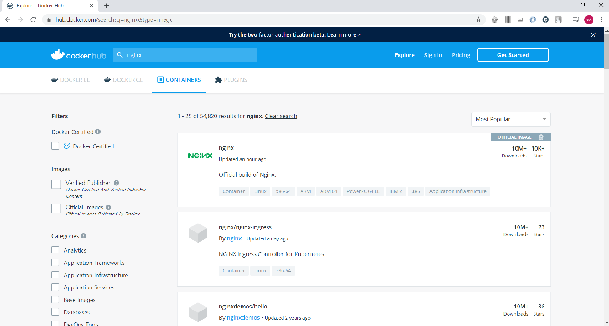

# Container Images, Where to find them and How to build them

이미지란

- 이미지를 한마디로 표현한다면 앱 바이너리와 의존성이라고 할 수 있다
  - 이미지를 어떻게 실행하는지에 대한 메타데이터도 포함하고 있다
- 이미지는 완전한 OS를 설치하는 것과 다르다
  - 커널이나 커널 모듈 또한 아니다
- 이미지는 그저 애플리케이션이 요구하는 바이너리에 불과하다
- 이미지는 하나의 파일처럼 매우 용량이 작다

---

The Might hub: 도커 허브에 등록된 이미지를 사용하기

- 컨테이너에게 도커 허브는 우분투의 apt 패키지 시스템과 같다
- 도커 허브에는 여러 가지 이미지가 등록되어 있다
- 2020.02.03을 기준으로 nginx를 검색하면 54820건이 조회된다
- 당연히 이렇게 많은 이미지들의 특징을 전부 파악해서 사용할 수는 없다
- 특별한 기준이나 지식 없다면 이미지를 검색했을 때 official이라는 설명이 붙어있는 이미지를 받으면 된다
- official 이미지는 루트 이미지 이므로 /유저명 or /단체명 같은 이름이 뒤에 붙지 않는다
  - ex. mysql/mysql-server : 오라클에서 만든 mysql 이미지



이미지 정보를 확인하는 커맨드

```terminal
$ docker image inspect <image-name>
```

이미지 업로드하기

- 우선 nginx의 태그를 변경해 나만의 이미지를 만든다
- 그리고 이미지를 도커 허브에 푸쉬한다

nginx 태그 변경

```terminal
$ docker image tag nginx <your-username>/nginx
```

도커 허브에 푸쉬

- 도커 허브에 푸쉬하기 위해서는 먼저 로그인을 해야 한다

```terminal
$ docker login
Username:
Password:
```

- 자신의 Username과 Password를 입력해서 로그인하자
- 로그아웃을 하고 싶으면 docker logout을 입력하면 된다

로그인이 완료됐으면 아래 형식으로 도커 허브에 푸쉬한다

```terminal
$ docker image push <your-username>/nginx
```

- docker hub사이트의 repository에 들어가서 확인해보자

testing tag의 이미지 올리기

- 앞선 방식대로 이미지를 푸쉬하면 latest 태그로 이미지가 올라간다
- 아직 안정화 단계에 있지 않은 testing 태그의 이미지를 같은 레포지토리에 올려보자

testing 태그의 이미지 만들기

```terminal
$ docker image tag <your-username>/nginx <your-username>/nginx:testing
```

testing 태그의 이미지 푸쉬하기

```terminal
$ docker image push <your-username>/nginx:testing
```
